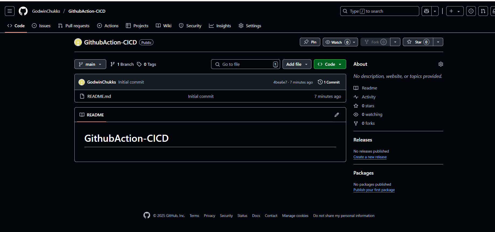
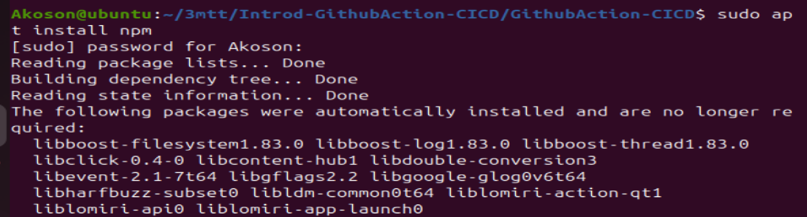
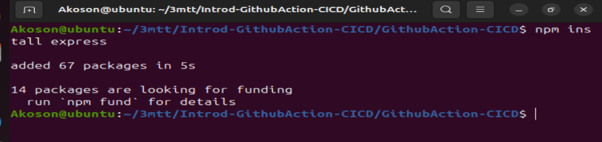
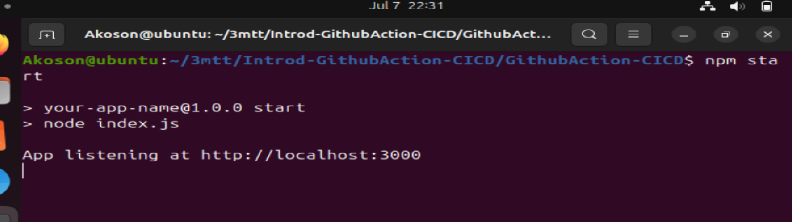
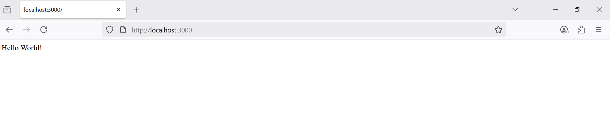
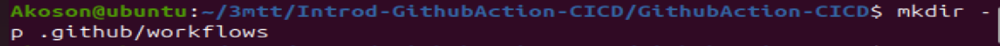
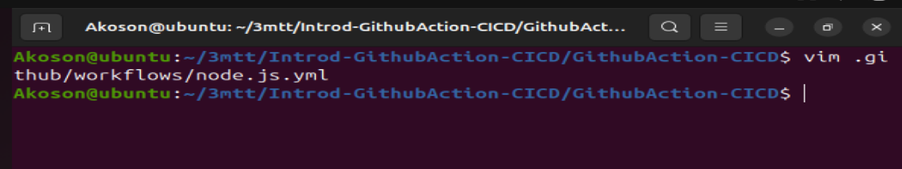
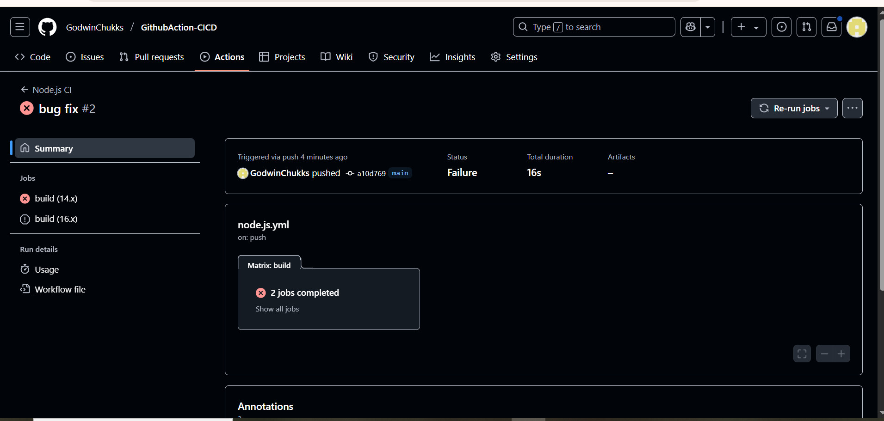

# GithubAction-CICD

# Introduction to Continuous Integration and Continuous Deployment

### The project will involve setting up a simple web application (e.g., a Node.js application) and applying CI/CD practices using GitHub Actions. This application will have basic functionality, such as serving a static web page.

### Introduction to GitHub Actions and CI/CD Course Project

### Welcome to our course on GitHub Actions and Continuous Integration/Continuous Deployment (CI/CD). This course is designed to provide a hands-on learning experience, guiding you through the essentials of automating software development processes using GitHub Actions. Whether you're a developer, a student, or just curious about CI/CD practices, this course will equip you with the practical skills and knowledge you need to implement these powerful automation techniques in your projects.

## Why is this relevant to learners

### Imagine you're a chef in a busy restaurant. Every dish you prepare is like a piece of software code. Without a systematic approach, you might end up with orders being mixed up, dishes taking too long to prepare, or worse, the quality of the food being inconsistent.

### This is where a well-organized kitchen, with clear processes and automation (like having appliances that precisely time and cook parts of the dishes), comes into play.

### In software development, CI/CD is akin to this efficient kitchen. It ensures that your "dishes" (software builds) are consistently "cooked" (built, tested, and deployed) with precision and efficiency.

### By learning GitHub Actions and CI/CD, you're essentially learning how to set up and manage your high-tech kitchen in the software world, allowing you to serve "dishes" faster, with higher quality, and with fewer "kitchen mishaps" (bugs and deployment issues).

## Prerequisites or Requirements

### 1. Basic Knowledge of Git and GitHub

- Understand version control concepts

- Be familiar with common Git commands: clone, commit, push, pull

- Have a GitHub account and know how to manage repositories

### 2. Understanding of Basic Programming Concepts

- Know core programming fundamentals (JavaScript preferred)

- Have a basic idea of how web applications work

### 3. Familiarity with Node.js and npm

- Know how to install and use Node.js

- Understand how to use npm for managing project dependencies

### 4. Text Editor or IDE

- A tool like Visual Studio Code, Atom, Sublime Text, or any editor of your choice for writing and editing code

### 5. Local Development Environment

- Node.js and npm installed on your computer

- Access to the command line or terminal (e.g., Bash, PowerShell)

### 6. Internet Connection

- A stable connection to access GitHub and other resources or documentation online

### 7. Basic Understanding of CI/CD Concepts (Optional but Helpful)

- General awareness of Continuous Integration and Continuous Deployment concepts

- This can be part of the learning in the course, but prior knowledge is beneficial

## Lesson 1: Understanding Continuous Integration and Continuous Deployment

### Objectives:

- Define CI/CD and understand its benefits

- Get familiar with the CI/CD pipeline


# Lesson Details
## 1. Definition and Benefits of CI/CD:

### Continuous Integration (CI) is the practice of merging all developers' working copies to a shared mainline several times a day.

### Continuous Deployment (CD) is the process of releasing software changes to production automatically and reliably.

## Benefits:

- Faster release rate

- Improved developer productivity

- Better code quality

- Enhanced customer satisfaction

## 2. Overview of the CI/CD Pipeline

### CI Pipeline typically includes steps like version control, code integration, automated testing, and building the application.

### CD Pipeline involves steps like deploying the application to a staging or production environment, and post-deployment monitoring.

### Tools: Version control systems (e.g., Git), CI/CD platforms (e.g., GitHub Actions), testing frameworks, and deployment tools.

## Lesson 2: Introduction to GitHub Actions

## Objectives:

- Understand what GitHub Actions is

- Learn key concepts and terminology

## Lesson Details:

### GitHub Actions: A CI/CD platform integrated into GitHub that automates the build, test, and deployment pipelines of your software directly within your GitHub repository

### Documentation Reference: Explore the GitHub Actions documentation for in-depth understanding

## Key Concepts and Terminology

### 1. Workflow

- A customizable automated process made of one or more jobs

- Defined in a YAML file in your GitHub repo

- Example: A workflow that builds and deploys your Node.js app whenever code is pushed

- Docs: GitHub Workflows guide

### 2. Event

- An activity that triggers the workflow (like push, pull request, or scheduled time)

- Example: On every push, your test workflow runs

- Docs: Events that trigger workflows

### 3. Job

- A collection of steps executed on the same runner

- Jobs can run one after the other or in parallel

- Example: A job that installs dependencies and runs unit tests

- Docs: Jobs documentation

### 4. Step

- A single task like running a command or an action

- Example: A step to run npm install

- Docs: Steps guide in GitHub Docs

### 5. Action

- A reusable block of code in steps—built-in or community-made

- Example: actions/checkout to clone your repo

- Docs: Creating and using GitHub Actions

### 6. Runner

- The server that runs workflows when they're triggered

- Can be GitHub-hosted or self-hosted

- Example: Ubuntu runner hosted by GitHub

- Docs: GitHub Runners page


## Additional Resources

- GitHub Learning Lab – Interactive courses

- GitHub Actions Quickstart – Hands-on intro

- Community Forums – Ask questions, find support


# Project Setup Instructions

## Step 1. Initialize a GitHub Repository

- Create a new repository on GitHub

- Clone it to your local machine



## Step 2. Creating a Simple Node.js Application

### Run npm init to initialize your Node.js project. In the project folder. run:

`npm init -y`

### This creates a package.jason file with default setting



##  Building a simple server using Express.js to serve a static web page

### We need Express for our server:

`npm install express`




## Step 3. Adding our code to the repo and push it back to GitHub

```
// Example: index.js
const express = require('express');
const app = express();
const port = process.env.PORT || 3000;

app.get('/', (req, res) => {"\n     res.send('Hello World!');\n   "});

app.listen(port, () => {
  console.log(`App listening at http://localhost:${port}`);
});

```

### We Create a file named index.js in the root of our project and paste the code about inside `index.js`

## Step 4: Running the App locally 

### First we start the server using the command: `npm start` then access the App on `http://localhost:3000`

### Start the server



### Accessing our Application via `http://localhost:3000` locally 




## Step 5: Writing our First GitHub Action Workflow

### 1. Creating a .github/workflows directory in our repository

`mkdir -p .github/workflows`



### 2. Adding a workflow file (e.g., node.js.yml). Open any code editor and paste the script into a new file named js.yml and save

`.github/workflows/node.js.yml`



### Step 6: Commiting and pushing the file to GitHub:

```
git add .
git commit -m "Add CI workflow for Node.js app"
git push origin main

```

### Step 7: GO to the Actions tab in our GitHub repo and watch the magic happen




```

# Example: .github/workflows/node.js.yml

# Name of the workflow
name: Node.js CI

# Specifies when the workflow should be triggered
on:
# Triggers the workflow on 'push' events to the 'main' branch
push:
    branches: [ main ]
# Also triggers the workflow on 'pull_request' events targeting the 'main' branch
pull_request:
    branches: [ main ]

# Defines the jobs that the workflow will execute
jobs:
# Job identifier, can be any name (here it's 'build')
build:
    # Specifies the type of virtual host environment (runner) to use
    runs-on: ubuntu-latest

    # Strategy for running the jobs - this section is useful for testing across multiple environments
    strategy:
    # A matrix build strategy to test against multiple versions of Node.js
    matrix:
        node-version: [14.x, 16.x]

    # Steps represent a sequence of tasks that will be executed as part of the job
    steps:
    - # Checks-out your repository under $GITHUB_WORKSPACE, so the job can access it
    uses: actions/checkout@v2

    - # Sets up the specified version of Node.js
    name: Use Node.js ${{" matrix.node-version "}}
    uses: actions/setup-node@v1
    with:
        node-version: ${{" matrix.node-version "}}

    - # Installs node modules as specified in the project's package-lock.json
    run: npm ci

    - # This command will only run if a build script is defined in the package.json
    run: npm run build --if-present

    - # Runs tests as defined in the project's package.json
    run: npm test

```

## Explanation:

### 1. `name`: This simply names your workflow. It's what appears on GitHub when the workflow is running.

### 2. `on`: This section defines when the workflow is triggered. Here, it's set to activate on push and pull request events to the main branch.

### 3. `jobs`: Jobs are a set of steps that execute on the same runner. In this example, there's one job named build.

### 4. `runs-on`: Defines the type of machine to run the job on. Here, it's using the latest Ubuntu virtual machine.

### 5. `strategy`.matrix: This allows you to run the job on multiple versions of Node.js, ensuring compatibility.

### 6. `steps`: A sequence of tasks executed as part of the job.

- actions/checkout@v2: Checks out your repository under $GITHUB_WORKSPACE.

- actions/setup-node@v1: Sets up the Node.js environment.

- npm ci: Installs dependencies defined in package-lock.json.

- npm run build --if-present: Runs the build script from package.json if it's present.

- npm test: Runs tests specified in package.json.

### This workflow is a basic example for a Node.js project, demonstrating how to automate testing across different Node.js versions and ensuring that your code integrates and works as expected in a clean environment.


## Testing and Deployment:

- Add automated tests for your application.

- Create a workflow for deployment (e.g., to a cloud service like Heroku or AWS).

## Experiment and Learn:

- Modify workflows to see how changes affect the CI/CD process.

- Try adding different types of tests (unit tests, integration tests).
